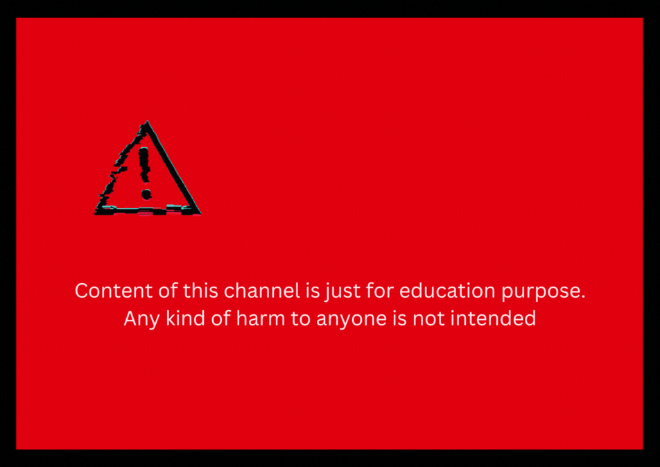

I'm experimenting all kind of cyber threats from scratch. Learning about them and trying to recreate them from scratch. I'm adding some basic threats now but will gradually dive into real world threat/vulnerabilities soon.

## Explanation
For demostration you can check out my youtube channel in the about section of this repository. I will create video upon each threat that I'm working with.

## Visit my website 
[WebPage]("./pages/index.html")

## List of threat
- Malware
- Phishing Website
- IDOR vulnerable website
